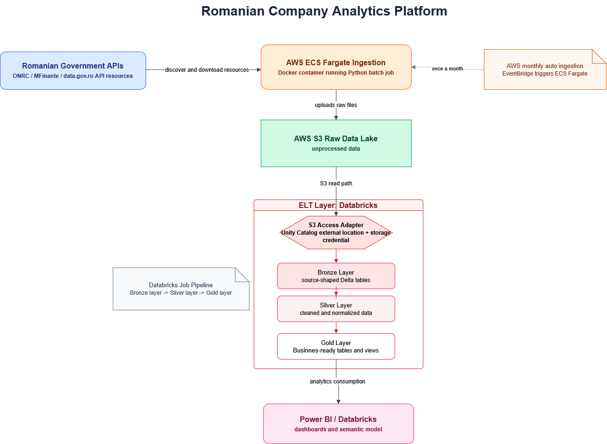
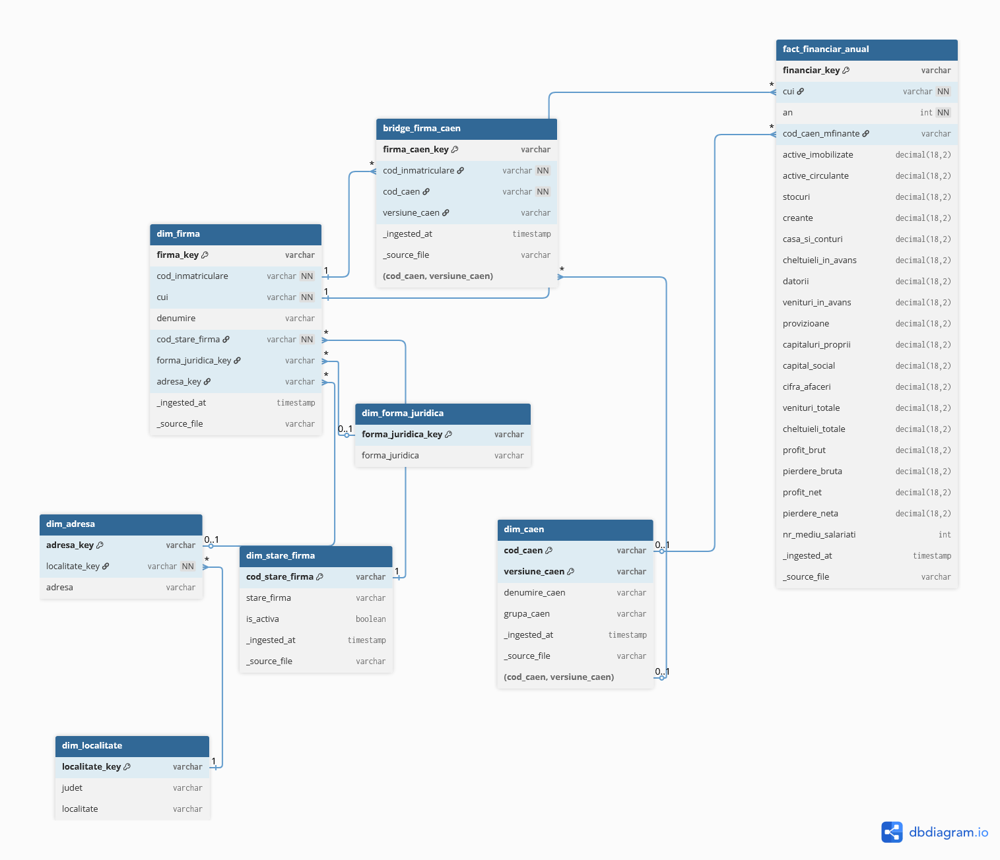

# Romanian Legal Entity Lakehouse

This project builds a warehouse for Romanian company analytics from national public data sources. It is designed to ingest the Romanian company universe exposed by ONRC and MFinante, store raw snapshots in AWS S3, normalize them in Databricks, and expose analytics-ready outputs to Power BI.

## Architecture Diagram

- [Architecture Diagram](C:/ro_company_analytics/Images/architecture.drawio)



The warehouse is meant to cover all companies present in the Romanian public source data, not a sample dataset.

The platform is built around `16` years of annual MFinante financial statement datasets from `2010` to `2025`

For each company, the model is designed to store a mix of identity, registry, classification, geography, and finance data such as:

- company name, CUI, and registration number
- legal status and legal form
- county, locality, and registered address
- authorized CAEN activities
- annual reported CAEN activity from MFinante
- turnover, total revenue, total expenses, gross and net profit
- equity, debt, capital, assets, receivables, inventories, cash
- employee counts across reporting years

## Tech Stack

- AWS (`ECS Fargate`, `S3 Bucket`, `ECR`, `EventBridge`, `CloudWatch`)
- Docker
- Python (PySpark)
- Databricks
- Power BI

## Data Model Diagram

- [dbdiagram Source](C:/ro_company_analytics/silver_star_schema.dbml)



## What It Does

- Pulls Romanian public company data from ONRC / MFinante / `data.gov.ro` API-backed datasets
- Runs containerized ingestion on AWS ECS Fargate
- Stores raw snapshots in S3 under `raw_v2`
- Uses Databricks with Unity Catalog to read and transform the lake
- Produces normalized Silver entities and BI-ready Gold outputs
- Feeds Power BI dashboards and reporting

## Impact

This app turns fragmented Romanian public company data into a usable analytical platform. Instead of manually combining messy registry files, CAEN mappings, company status tables, and yearly financial statement exports, it gives you a single warehouse that can be queried consistently across companies, industries, years, and geographies.

That makes the data much more useful for:

- regional economic analysis by county and locality
- company benchmarking across turnover, profit, debt, capital, and employees
- sector analysis using official CAEN classifications
- identifying top companies by year, industry, and location
- lead generation and market mapping for Romanian businesses
- building Power BI dashboards for decision-making without hand-cleaning source files every time

## Source Data

Configured sources are defined in `config/datasets.json`.

Main sources:

- ONRC company registry data
- ONRC authorized CAEN mappings
- ONRC company status data
- ONRC CAEN nomenclature
- MFinante annual financial statements

Key raw file patterns:

- `od_firme.csv`
- `od_caen_autorizat.csv`
- `od_stare_firma.csv`
- `n_caen.csv`
- `n_stare_firma.csv`
- `web_uu_anYYYY.txt`
- `web_uu_anYYYY.csv`

The annual MFinante files are stored by actual source year:

```text
s3://ro-company-lake/raw_v2/mfinante/situatii_financiare_uu/
  source_year=2025/
    snapshot_date=YYYY-MM-DD/
      web_uu_an2025.csv
      web_uu_an2025.txt
```

That partitioning matters because historical CKAN packages are inconsistent and sometimes bundle multiple years together.

## Running Ingestion

Prerequisites:

- Python `3.12`
- AWS credentials with write access to the target S3 bucket
- Network access to `https://data.gov.ro`

Install dependencies:

```powershell
pip install -r requirements.txt
```

Run locally:

```powershell
$env:S3_BUCKET = "ro-company-lake"
$env:AWS_REGION = "eu-central-1"
$env:CONFIG_PATH = "config/datasets.json"
python app/downloader.py
```

The ingestion app:

- reads `config/datasets.json`
- queries CKAN/API resources
- filters matching files
- downloads to temporary local storage
- uploads raw files to S3
- writes useful source metadata
- skips files already present at the target key

## AWS Deployment

Main AWS components:

- ECR repository: `ro-company-downloader`
- ECS cluster: `ro-company-cluster`
- ECS task definition: `ro-company-downloader-task`
- CloudWatch log group: `/ecs/ro-company-downloader`
- S3 bucket: `ro-company-lake`
- AWS region: `eu-central-1`

Intended automation path:

- EventBridge Scheduler triggers ECS Fargate once per month
- ECS runs the containerized ingestion task
- Raw snapshots land in S3
- Databricks reads the new snapshot and runs Bronze -> Silver -> Gold

## Databricks Workflow

Unity Catalog objects:

- Catalog: `company_ro`
- Schemas: `bronze`, `silver`, `gold`
- External location: `s3://ro-company-lake/raw_v2/`

Current notebook execution order:

1. `notebooks/00_bronze_layer/bronze_onrc_firme.ipynb`
2. `notebooks/00_bronze_layer/bronze_onrc_caen_autorizat.ipynb`
3. `notebooks/00_bronze_layer/bronze_onrc_stare_firma.ipynb`
4. `notebooks/00_bronze_layer/bronze_n_caen.ipynb`
5. `notebooks/00_bronze_layer/bronze_mfinante_uu_all_years.ipynb`
6. `notebooks/01_silver_layer/silver_onrc_dimensions.ipynb`
7. `notebooks/01_silver_layer/silver_fact_financiar_anual.ipynb`
8. `notebooks/02_gold_layer/gold_company_financial_summary.ipynb`
9. `notebooks/02_gold_layer/gold_location_caen_year_stats.ipynb`
10. `notebooks/02_gold_layer/gold_top_companies.ipynb`

Silver tables:

- `company_ro.silver.dim_firma`
- `company_ro.silver.dim_stare_firma`
- `company_ro.silver.dim_forma_juridica`
- `company_ro.silver.dim_localitate`
- `company_ro.silver.dim_adresa`
- `company_ro.silver.dim_caen`
- `company_ro.silver.bridge_firma_caen`
- `company_ro.silver.fact_financiar_anual`

## Gold Outputs

Gold tables:

- `company_ro.gold.company_financial_summary`
- `company_ro.gold.location_caen_year_stats`
- `company_ro.gold.top_companies_by_year`

Gold is intentionally denormalized for Power BI consumption. Silver remains the normalized source of truth.

## Power BI

Recommended slicers:

- `an`
- `judet`
- `localitate`
- `caen_display_name`
- `grupa_caen`
- `clasa_caen`
- `denumire`
- `stare_firma`

Recommended measures:

- `SUM(cifra_afaceri)`
- `SUM(profit_net)`
- `SUM(pierdere_neta)`
- `SUM(nr_mediu_salariati)`
- `SUM(datorii)`
- `SUM(capitaluri_proprii)`
- `COUNTDISTINCT(cui)`

Important modeling rule:

- Do not aggregate financial measures through `bridge_firma_caen` unless you intentionally handle many-to-many duplication.
